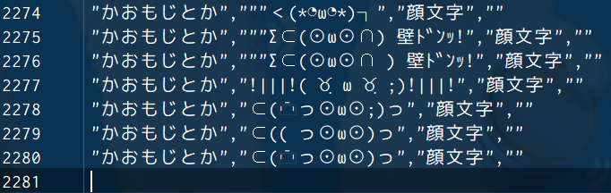
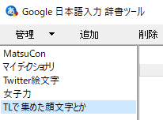
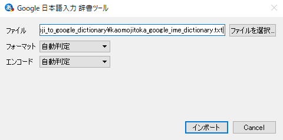
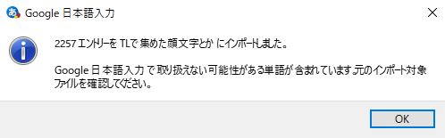
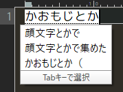
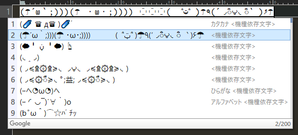

# Kaomojitoka to Google IME Dictionary

## What's 'KAOMOJITOKA'?
- `KAOMOJITOKA` is Japanese emoticons collection
    - the official site is [here](http://kaomoji.n-at.me/)
    - the repository is [here](https://github.com/tatat/kaomoji.html)
- the official site provides Web API
    - the document is [here](https://github.com/tatat/kaomoji.html/blob/master/README.md)

## What's this app?
- this app enables to convert the raw API response such as `KAOMOJITOKA` to Google IME dictionary format

## How to use
- very simple to use

### 1. exec app
```bash
$ ruby kaomojitoka_to_google_ime_dictionary.rb
```

### 2. the dictionary file is created
- You can get `./kaomojitoka_to_google_ime_dictionary.sample.txt`, which is the very Google IME dictionary file (CSV)
- the sample of output file is `kaomojitoka_to_google_ime_dictionary.sample.txt`



### 3. import dictionary file to Google IME
- please import `./kaomojitoka_to_google_ime_dictionary.sample.txt` to Google IME







### 4. confirm to convert correctly
- when Google IME is on, input `かおもじとか` and try to convert.
- the conversion candidates of Japanese emoticons are shown
- Be good communication :)





# Note
- now [`kaomojitoka_to_google_ime_dictionary.rb`](https://github.com/corselia/kaomojitoka-to-google-ime-dictionary/blob/master/kaomojitoka_to_google_ime_dictionary.rb) is uncomplete code because of [this article (Japanese, sorry)](https://obel.hatenablog.jp/entry/20180610/1528593119)
- so I modify [`kaomojitoka_to_google_ime_dictionary.txt`](https://github.com/corselia/kaomojitoka-to-google-ime-dictionary/blob/master/kaomojitoka_to_google_ime_dictionary.txt) manually
- I wanna modify this bug(?)

# LICENSE
- [MIT LICENSE](LICENSE)